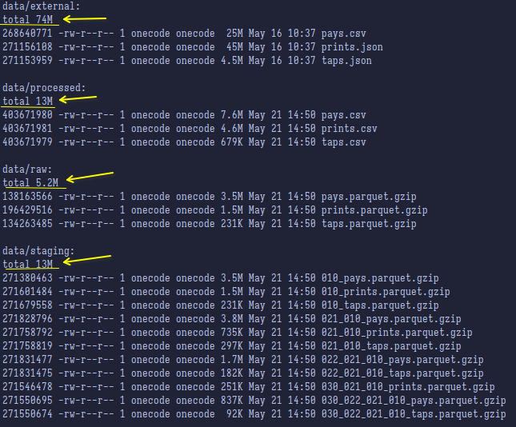
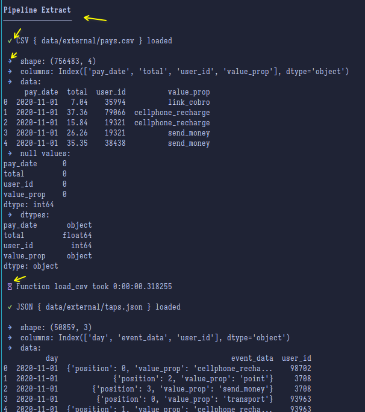
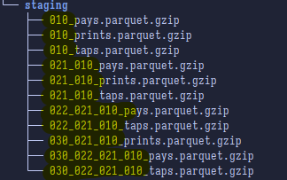

<a name="top"></a>
<h1 align="center">
    <br>
    
    <br>
    Mercado Libre - Prueba Técnica
    <br>
</h1>

<h4 align="center">
    Desarrollado por: Sebastián Martínez <a href="https://github.com/JuanS3">@JuanS3</a>
</h4>

<p align="center">
    
</p>

<p align="center">
  <a href="#estructura-del-proyecto">Estructura del proyecto</a> •
  <a href="#pipelines">Pipelines</a> •
  <a href="#steps">Steps</a> •
  <a href="#clonar-y-ejecytar">Clonar y Ejecutar</a> •
  <a href="#trabajo-futuro">Trabajo Futuro</a>
</p>

> Este es el repositorio para la prueba técnica de Mercado Libre.

Este repositorio contiene un pipeline ETL (Extract, Transform, Load) diseñado para procesar datos de pagos, impresiones y toques (taps) y realizar diversas transformaciones y agrupaciones en ellos.

# Estructura del Proyecto <div id="estructura-del-proyecto"></div>

> Estructura de directorios
```bash
MeLi
├── config
│   └── config.yaml
├── config.py
├── data
│   ├── external
│   │   ├── pays.csv
│   │   ├── prints.json
│   │   └── taps.json
│   ├── processed
│   ├── raw
│   └── staging
├── etl
│   ├── extr
│   │   ├── extraction.py
│   │   ├── __init__.py
│   ├── __init__.py
│   ├── load
│   │   ├── __init__.py
│   │   ├── load.py
│   ├── transversal.py
│   ├── trsf
│   │   ├── __init__.py
│   │   └── transform.py
│   └── utils
│       ├── decorators.py
│       ├── __init__.py
│       ├── logging.py
│       ├── pprint.py
├── main.py
├── pipeline
│   ├── __init__.py
│   ├── pipe_extr.py
│   ├── pipe_trsf.py
├── README.md
├── requirements.txt
└── tests
```

## Carpeta `data`

Esta carpeta de compone de una sección de archivos de datos (`raw`, `processed`, `staging` y `external`):

* **external** : Contiene los archivos de datos externos (`pays.csv`, `prints.json`, `taps.json`), de esta forma se simula que se obtienen de una fuente externa.
* **raw** : Contiene los archivos de datos crudos, en este caso serian los archivos de datos originales que se encuentran en la carpeta `external`.
* **staging** : Contiene los archivos de datos temporales, estos archivos temporales corresponde a los procesos que se ejecutan en el pipeline.
* **processed** : Contiene los archivos de datos procesados, los cuales de archivos se guardan en esta carpeta.

Es importante aclarar que en la carpeta `external` los archivos se encuentran en el formato original, es decir, `csv`, `json`, etc. mientras que en las carpetas
 `raw` y `staging` los archivos se encuentran en formato `parquet`, junto con una compresion en `gzip`, esto con la finalidad de ahorrar espacio en disco y poder
 procesarlos de manera mas eficiente, en la carpeta `processed` se guardan los archivos en cualquier formato que se desee, esto para facilitar la lectura de los datos
 por parte de otros equipos de trabajo que requieran los datos procesados.

<div align="center">
    
    <br>
    Folder Data Example
</div>

## Carpeta `etl`

Dentro de esta carpeta se encuentran los archivos python del ETL (Extract, Transform, Load) realizado para la prueba, además de unas implementaciones de pipelines para extraccion y transformacion de datos.

### Carpeta `etl/extr`

En esta sección se encuentran los archivos python que se utilizan para la extracción de datos.

### Carpeta `etl/trsf`

En esta sección se encuentran los archivos python que se utilizan para la transformación de datos.

### Carpeta `etl/load`

En esta sección se encuentran los archivos python que se utilizan para la carga de datos.

### Carpeta `etl/utils`

En esta sección se encuentran los archivos python que se utilizan como utilidades para las diferentes etapas del proceso, como la definición del ~log (`logging.py`)~ _este aún no se encuentra implementado_,
una definición de `pprint` (`pprint.py`) y una definición de `decorators` (`decorators.py`), en los prints son de ayuda para revisar la ejecución del proceso por consola, como en la siguiente imagen se muestra:

<div align="center">
    
    <br>
    Uso del `pprint`
</div>

De esta forma también es posible llevar una trazabilidad por consola del proceso de ETL.

***NOTA: El uso de `pprint` no reemplaza en ningún caso el uso de `logging`, este solo cumple el papel de apoyo visual para la ejecución del proceso***

### Archivo `etl/transversal.py`

Este archivo de Python tiene como única finalidad mantener funciones comunes que serán utilizadas por los pipelines de ETL.

## Pipelines <div id="pipelines"></div>

En este módulo se encuentran todos los pipelines de ETL que se crearon para la prueba, actualmente existen dos pipelines, uno para el proceso de extracción de datos y el otro para el proceso de transformación de datos.
Se pueden ejecutar por separado o en conjunto sin ningún inconveniente.

## Steps <div id="steps"></div>

Para llevar un orden de ejecución de los pipelines, principalmente en el paso de transformación de datos, se crearon unas convenciones para poder identificar las diferentes etapas del proceso de transformación de datos, tal como se muestra en la siguiente imagen:

<div align="center">
    
    <br>
    Uso de los steps
</div>

Adicionalmente esto nos ayuda a identificar directamente la trazabilidad de un fichero en caso de que se necesite revisar algún paso en particular o se requiera una corrección de un error.

# Clonación y Ejecución <div id="clonar-y-ejecytar"></div>

Para clonar el repositorio se puede hacer de la siguiente forma:

```bash
git clone https://github.com/JuanS3/MeLi.git
```

Generar un entorno virtual de python e instalar las dependencias de este proyecto:

> Sistemas basados en GNU/Linux
```bash
python3 -m venv .venv
source .venv/bin/activate
python -m pip install --upgrade pip
pip install -r requirements.txt
```
> Sistemas Windows
```batch
python -m venv .venv
.venv\Scripts\activate.bat
python -m pip install --upgrade pip
pip install -r requirements.txt
```

Y ejecutar el pipeline de ETL, para esto es importante que se los archivos de la prueba se encuentren en la carpeta `data/external`:
```bash
python main.py
```

# Trabajo futuro <div id="trabajo-futuro"></div>

Aún faltan un par de tareas para mejorar este proceso de ETL, entre ellas se encuentran:

* [ ] Implementación del log (`logging.py`)

* [ ] Agregar un control de errores

* [ ] Implementación de sistema de ejecución por parámetros en el que se pueda configurar el pipeline de ETL

    * [ ] Permitir ejecutar solo extraciones, transformaciones o cargas

    * [ ] Permitir solo ejecutar partes especificas de los pipelines

    * [ ] Permitir que en caso de error volver a intentar la ejecución del pipeline, o del fragmento que fallo.

* [ ] Implementar extracciones desde base de datos

* [ ] Implementar guardado en base de datos

* [ ] Implementar lecto/escritura en cloud, como Google Cloud Storage o Amazon S3

* [ ] Dockerizar la aplicación

Son solo alginas de tareas a futuro a realizar, pero se pueden desglosar muchas más, como envio de correos o alertas de error.
